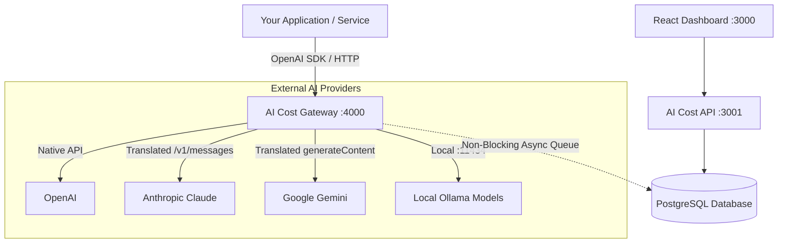

<div align="center">

# AI Cost

**Open-source AI usage, cost, latency, and model observability for developers.**

[](https://opensource.org/licenses/MIT)
[](https://nodejs.org/)
[](https://www.typescriptlang.org/)
[](https://www.docker.com/)

[Quickstart](#-quickstart) • [Architecture](#-architecture) • [Gateway](#-openai-compatible-gateway) • [Dashboard](#-dashboard) • [Multi-Provider](#-multi-provider-support) • [Docs](docs/getting-started.md)

</div>

---

## 💡 Overview

**AI Cost** is a self-hostable developer platform that allows engineering teams to monitor their AI and LLM usage across multiple providers from a unified dashboard.

Point your applications at the **AI Cost Gateway** and instantly collect:
* 📊 **Token Consumption** — Input, output, and cached tokens (Anthropic / OpenAI prompt caching)
* 💰 **Estimated Costs** — Real-time cost calculations powered by a centralized pricing registry
* ⚡ **Latency Profiling** — End-to-end request duration and upstream provider response times
* 🚨 **Error Monitoring** — Rate limits (429s), timeouts, and HTTP status codes
* 🏢 **Multi-Project & Multi-Provider** — Segment spend across projects, models, and environments
* 🎯 **Cost Optimization Insights** — Automated heuristics detecting expensive model usage and cache savings
* 🛡️ **Zero-Content Storage** — Raw prompts and completions are never stored by default

---

## 🏛 Architecture



---

## 🚀 Quickstart

### Option 1: Docker Compose (Production Ready)

```bash
git clone https://github.com/your-username/ai-cost.git
cd ai-cost
docker compose up -d
```

Open **`http://localhost:3000`** to view your dashboard.

### Option 2: Local Development (Instant with Embedded Database)

No Docker or PostgreSQL daemon required! AI Cost includes an embedded WebAssembly PostgreSQL engine (`PGlite`) out of the box for zero-dependency local runs.

```bash
git clone https://github.com/your-username/ai-cost.git
cd ai-cost
npm install
npm run seed      # Seeds 30 days of realistic multi-provider telemetry
npm run dev
```

* **Dashboard**: `http://localhost:3000`
* **Gateway**: `http://localhost:4000/v1`
* **API Server**: `http://localhost:3001`
* **Admin Login**: `admin@aicost.local` (Password: `password123`)

---

## 🔌 OpenAI-Compatible Gateway

The Gateway allows you to start collecting telemetry with **zero changes to your application architecture**. Simply point your existing SDK base URL to AI Cost:

```typescript
import OpenAI from 'openai';

const openai = new OpenAI({
  apiKey: 'ac_live_demo_prod_chatbot_987654321', // Your AI Cost Project Key
  baseURL: 'http://localhost:4000/v1'            // AI Cost Gateway
});

// Works seamlessly with any supported model
const response = await openai.chat.completions.create({
  model: 'gpt-4o',
  messages: [{ role: 'user', content: 'What is the speed of light?' }]
});

console.log(response.choices[0].message.content);
```

### Multi-Provider Model Routing

You can route to Anthropic or Gemini using the same standard OpenAI SDK:

```typescript
// Routes to Anthropic Claude 3.5 Sonnet transparently:
const claudeResponse = await openai.chat.completions.create({
  model: 'claude-3-5-sonnet-latest',
  messages: [{ role: 'user', content: 'Explain distributed systems' }]
});

// Routes to Google Gemini 1.5 Flash:
const geminiResponse = await openai.chat.completions.create({
  model: 'gemini-1.5-flash',
  messages: [{ role: 'user', content: 'Write a unit test for sorting' }]
});
```

---

## 📊 Dashboard Preview

```text
AI Cost                                      [All Projects ▼]  [Last 30 Days ▼]
───────────────────────────────────────────────────────────────────────────────

Total Spend          Requests         Tokens           Avg Latency     Error Rate
$1,284.42            128,492          82.4M            642ms           1.8%
Estimated AI cost    126.1K success   18.2M cached     End-to-end      2.3K failed

Spend Over Time
───────────────────────────────────────────────────────────────────────────────
 $80 ┤                                                    ╭───╮
 $60 ┤                                              ╭─────╯   ╰──
 $40 ┤                              ╭───────────────╯
 $20 ┤          ╭───────────────────╯
  $0 ┴──────────┴──────────────────────────────────────────────────────
      May 10    May 15    May 20    May 25    May 30    Jun 4     Jun 9

Spend by Provider                       Spend by Model
────────────────────────────            ────────────────────────────
OpenAI       $842.10 (65.6%)            gpt-4o               $542.10
Anthropic    $321.40 (25.0%)            claude-3-5-sonnet    $321.40
Gemini       $120.92 ( 9.4%)            gpt-4o-mini          $210.00
Ollama       $  0.00 ( 0.0%)            gemini-1.5-flash     $120.92

Cost Optimization Insights
───────────────────────────────────────────────────────────────────────────────
⚠ Model gpt-4o accounts for 58% of total spend ($542.10)
  Recommendation: Evaluate if simpler classification tasks can use gpt-4o-mini.

💡 Prompt Caching is active (18.2M tokens served from cache)
  Estimated savings: $45.50 this month.
```

---

## 📦 Multi-Provider Support

| Provider | Models Supported | Token Extraction | Streaming | Cost Tracking |
|---|---|---|---|---|
| **OpenAI** | GPT-4o, GPT-4o Mini, o1, o1-mini, o3-mini, GPT-4 Turbo | Native | Yes | Yes |
| **Anthropic** | Claude 3.5 Sonnet, Claude 3.5 Haiku, Claude 3 Opus | Translated | Yes | Yes (incl. Cache) |
| **Google Gemini** | Gemini 1.5 Pro, Gemini 1.5 Flash, Gemini 2.0 Flash | Translated | Yes | Yes |
| **Ollama** | Llama 3.3, Mistral, DeepSeek-R1 (Local self-hosted) | Native | Yes | $0.00 / Custom |

---

## 🛠 Project Structure

```text
ai-cost/
├── apps/
│   ├── api/            # Fastify REST API for analytics, auth, budgets & keys
│   ├── dashboard/      # Vite + React + Tailwind + Recharts observability dashboard
│   └── gateway/        # Fastify OpenAI-compatible reverse proxy (/v1/chat/completions)
├── packages/
│   ├── types/          # Domain models & Zod validation schemas
│   ├── pricing/        # Centralized model pricing registry & cost engine
│   ├── database/       # PostgreSQL client (with PGlite fallback) & repositories
│   └── sdk/            # @ai-cost/sdk client & automatic wrappers
├── examples/           # Runnable examples for OpenAI, Anthropic, Gemini, curl, and SDK
├── docker/             # Multi-stage Dockerfiles for API, Gateway, and Dashboard
├── docs/               # Comprehensive developer guides
├── scripts/            # Database seed script & maintenance tools
└── docker-compose.yml  # Production multi-service configuration
```

---

## 🛡️ Security & Privacy

* **No Sensitive Content Logging**: Prompt and completion texts are never written to disk or database.
* **Hashed API Keys**: Keys (`ac_live_...`) are cryptographically hashed using SHA-256 before storage and shown only once.
* **Redacted Headers**: Authorization tokens and provider credentials are automatically scrubbed from logs.
* **Fail-Safe Operation**: Configurable `FAIL_OPEN=true` ensures telemetry storage issues never disrupt production AI traffic.

---

## 📄 Pricing Disclaimer

> Costs shown across all views are estimates based on configured model pricing and reported token usage. Actual provider billing may differ. AI Cost is an independent observability tool and is not an official billing service for any AI provider.

---

## 📜 License

MIT License — free for commercial and personal use. See [LICENSE](LICENSE) for details.
